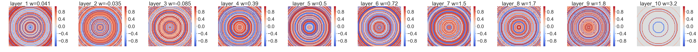

# ONNet

**ONNet** is an open-source Python/C++ package for the optical neural networks, which provides many tools for researchers studying optical neural networks. Some new models are as follows:

- #### Express Wavenet

  

  Express Wavenet uses random shift wavelet pattern to modulate the phase of optical waves, which  only need one percent of the parameters and the accuracy is still high. In the MNIST dataset, it only needs 1229 parameters to get accuracy of 92%, while DDNet needs 125440 parameters. .[2]

- #### Diffractive deep neural network with multiple frequency-channels

  Each layer have multiple frequency-channels (optical distributions at different frequency). These channels are merged at the output plane with weighting coefficient. [1]

- #### Diffractive network with multiple binary output plane

  

Optical neural network(ONN) is a novel machine learning framework on the physical principles of optics, which is still in its infancy and shows great potential. ONN tries to find optimal modulation parameters to change the phase, amplitude or other physical variable of optical wave propagation. So in the final output plane, the optical distribution has special pattern which is the indicator of object’s class or value. ONN opens new doors for the machine learning.


## Citation

Please use the following bibtex entry:
```
[1] Chen, Yingshi, et al."An optical diffractive deep neural network with multiple frequency-channels." arXiv preprint arXiv:1912.10730 (2019).
[2] Chen, Yingshi."Express Wavenet - a low parameter optical neural network with random shift wavelet pattern." arXiv preprint arXiv:2001.01458 (2020).
```

## Future work

- More testing datasets 

  ​	Cifar, ImageNet ......

- More models.

  ​	Wavefront Matching Method

  ​	Express network	

- More papers.

  

## License

The provided implementation is strictly for academic purposes only. If anyone is interested in using our technology for any commercial use, please contact us.

## Authors

Yingshi Chen (gsp.cys@gmail.com)

QQ group: 1001583663